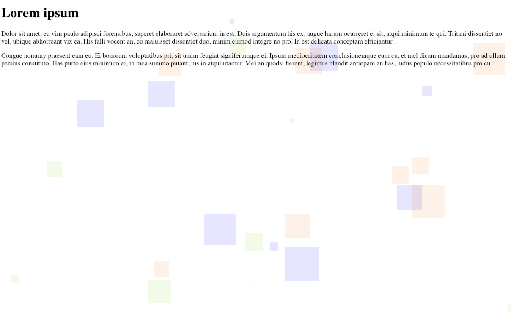

# dotbot

dotbot is a simple library that let's you create a randomised, dotted background-pattern on any given element on your website.

## Example

To initiate dotbot. simply include the library and call the dot function like so:
<pre><code>var myDots = new dotbot({
  selectorId: "dotbot-selector-id"
)};
</code></pre>

## Options
You can define almost every aspect of layout:
<pre><code>var myDots = new dotbot({
  selectorId: "dotbot-selector-id",
  parentPosition: "relative",
  colors: [
     "blue",
     "rgb(126, 211, 33)",
     "#f06d06"
  ],
  sizeMin: 3,
  sizeMax: 80,
  dots: 35,
  radius: 0,
  opacity: 0.1,
  zIndex: -1
});</code></pre>